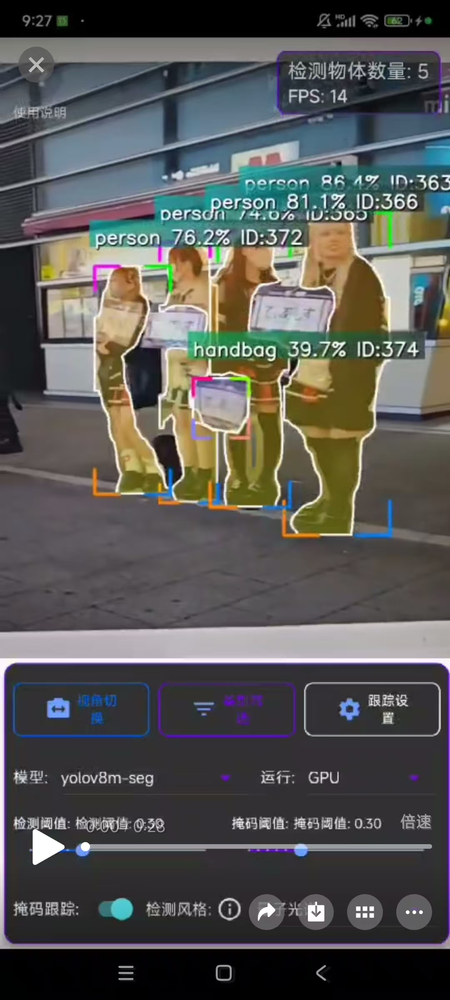
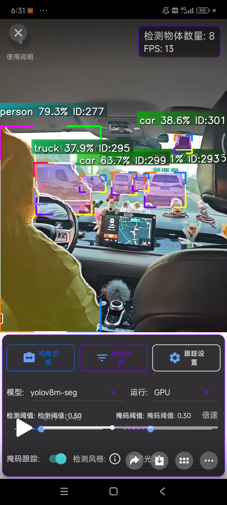
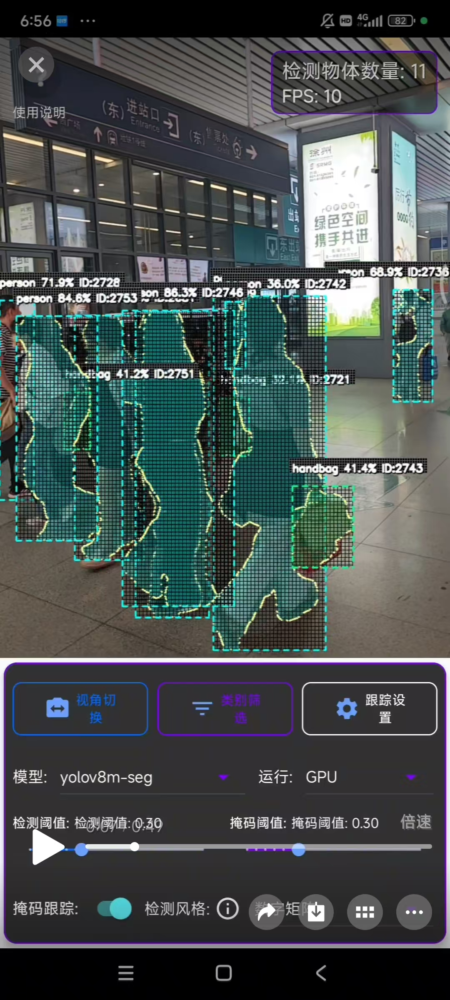
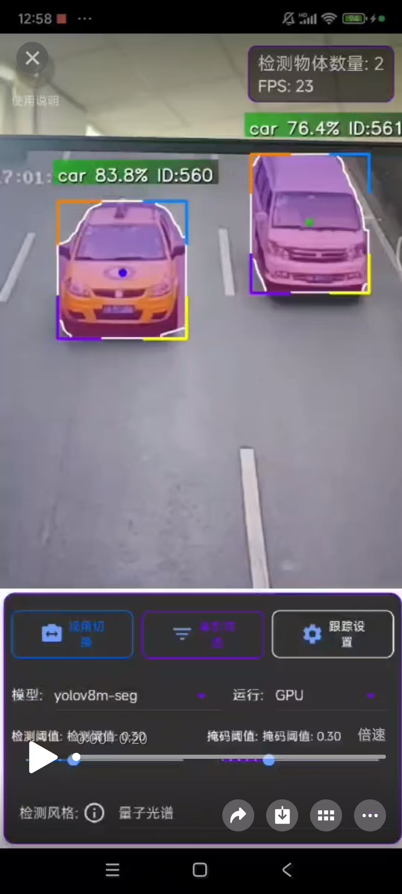

# <div align="center"></div>
# <div align="center">🔍 Real-time Android Object Detection App (English)</div>

<div align="center">

[](https://opensource.org/licenses/MIT)
[](https://github.com/dmwzw/AICV-Mobile/stargazers)
[](CONTRIBUTING.md)


</div>

<div align="center">
<b>👨‍💻 Author:</b> <a href="https://github.com/dmwzw">dmwzw</a> (<a href="mailto:1669406579@qq.com">1669406579@qq.com</a>)<br>
<b>📱 Download:</b> <a href="https://github.com/dmwzw/AICV-Mobile/releases/tag/AI">AICV-Mobile-V1.0 (Pre-release)</a>
</div>

<p align="center">
  
</p>

<div align="center">
<h3>📊 Real-time Performance | 🔍 Precise Detection | 🎯 Object Tracking | 📱 Mobile Optimized</h3>
</div>

---

##  

> ***AICV-Mobile*** is a **mobile computer vision application** based on YOLOv8 and an improved OC-SORT algorithm, designed and optimized for the Android platform. This project implements efficient object detection, instance segmentation, and object tracking, including mask (segmentation) tracking to follow the shape changes of targets in real-time.

<details>
<summary><b>📑 目录 (Table of Contents)</b></summary>

- [项目简介](#-项目简介)
- [功能特点](#-功能特点-)
- [效果演示](#-效果演示-)
- [技术实现](#️-技术实现-)
  - [目标跟踪机理](#目标跟踪机理)
  - [掩码跟踪机理](#掩码跟踪机理)
  - [错误处理](#错误处理)
- [系统要求](#-系统要求-)
- [编译与安装](#️-编译与安装-)
  - [前提条件](#前提条件)
  - [编译步骤](#编译步骤)
- [使用指南](#-使用指南-)
  - [基本使用](#基本使用)
  - [设置选项](#设置选项)
- [代码结构](#-代码结构-)
  - [关键组件 C++](#关键组件-c)
- [贡献指南](#-贡献指南-)
- [许可证](#-许可证-)
- [致谢](#-致谢-)
- [联系方式](#-联系方式-)
- [中文版本](#-aicv-mobile-)

</details>

## 

<div align="center">
<table>
  <tr>
    <th align="center">🔑 特性</th>
    <th align="center">📝 描述</th>
  </tr>
  <tr>
    <td>🔍 <b>高效目标检测</b></td>
    <td>基于YOLOv8模型，支持COCO数据集80类通用目标检测</td>
  </tr>
  <tr>
    <td>🎨 <b>实例分割</b></td>
    <td>支持物体的精确分割，生成高质量掩码</td>
  </tr>
  <tr>
    <td>🎯 <b>目标跟踪</b></td>
    <td>实现了改进版OC-SORT算法，结合卡尔曼滤波器提高跟踪精度</td>
  </tr>
  <tr>
    <td>🎭 <b>掩码跟踪</b></td>
    <td>能够跟踪目标形状变化，支持掩码预测和时间域平滑</td>
  </tr>
  <tr>
    <td>🌈 <b>多样化显示风格</b></td>
    <td>支持多种检测框、掩码和轨迹的显示风格</td>
  </tr>
  <tr>
    <td>📈 <b>轨迹可视化</b></td>
    <td>可显示目标的运动轨迹线</td>
  </tr>
  <tr>
    <td>⚡ <b>性能优化</b></td>
    <td>针对移动设备进行了性能优化，禁用C++异常处理</td>
  </tr>
  <tr>
    <td>🚄 <b>实时性能</b></td>
    <td>m模型FPS在10-20左右，n模型FPS可达到30以上</td>
  </tr>
  <tr>
    <td>🔎 <b>类别筛选</b></td>
    <td>支持按需启用/禁用特定目标类别的检测，精准识别所需目标</td>
  </tr>
  <tr>
    <td>🔄 <b>模式切换</b></td>
    <td>支持多种工作模式的实时切换：手持模式、稳定模式、多种运动模式和空间分布模式</td>
  </tr>
</table>
</div>

## 

<div align="center">
  <h3>📱 实时检测与跟踪效果展示</h3>
  <table>
    <tr>
      <td align="center">
        <h4>🚶 行人跟踪</h4>
      </td>
      <td align="center">
        <h4>🚗 车辆监测</h4>
      </td>
    </tr>
    <tr>
      <td align="center">
        <a href="https://github.com/dmwzw/AICV-Mobile/raw/main/app/demo/1.mp4">
          
        </a>
      </td>
      <td align="center">
        <a href="https://github.com/dmwzw/AICV-Mobile/raw/main/app/demo/2.mp4">
          
        </a>
      </td>
    </tr>
    <tr>
      <td align="center">
        <h4>🎭 掩码跟踪</h4>
      </td>
      <td align="center">
        <h4>🎯 多目标检测</h4>
      </td>
    </tr>
    <tr>
      <td align="center">
        <a href="https://github.com/dmwzw/AICV-Mobile/raw/main/app/demo/3.mp4">
          
        </a>
      </td>
      <td align="center">
        <a href="https://github.com/dmwzw/AICV-Mobile/raw/main/app/demo/4.mp4">
          
        </a>
      </td>
    </tr>
  </table>
</div>

<div align="center">
  <i>👆 点击图片查看对应的演示视频</i>
  <br/><br/>
  <a href="https://github.com/dmwzw/AICV-Mobile/releases/tag/AI">
    
  </a>
</div>

## 

<div align="center">
  
</div>

###  

> 本项目采用改进版的OC-SORT (Observation-Centric SORT) 思想，并结合卡尔曼滤波器 (Kalman Filter) 进行目标跟踪，以提高精度和鲁棒性：

<table>
  <tr>
    <td align="center" width="70"><b>步骤 1</b></td>
    <td><b>预测阶段</b>：使用卡尔曼滤波预测每个跟踪对象的下一帧状态（位置、速度等）。</td>
  </tr>
  <tr>
    <td align="center"><b>步骤 2</b></td>
    <td><b>关联阶段</b>：计算预测位置与当前帧检测结果之间的关联代价（综合IoU、距离等），并使用匈牙利算法或贪婪算法进行匹配。</td>
  </tr>
  <tr>
    <td align="center"><b>步骤 3</b></td>
    <td><b>更新阶段</b>：使用匹配成功的检测结果更新对应跟踪对象的卡尔曼滤波器状态。</td>
  </tr>
  <tr>
    <td align="center"><b>步骤 4</b></td>
    <td><b>生命周期管理</b>：处理未匹配的检测（创建新轨迹）和未匹配的跟踪（标记丢失、删除超时轨迹）。</td>
  </tr>
</table>

###  

<div class="code-block" style="background-color: #f6f8fa; border-left: 3px solid #FF5733; padding: 1em; margin: 1em 0;">
<ol>
  <li><b>掩码历史</b>：每个跟踪对象保存最近若干帧的掩码历史。</li>
  <li><b>掩码预测</b>：当目标丢失（检测失败）但跟踪保持时，基于运动预测变换（如仿射变换 <code>warpAffine</code>）上一帧的掩码。</li>
  <li><b>掩码平滑</b>：使用时间域加权平均减少掩码抖动。</li>
</ol>
</div>

###  

> 由于项目禁用了C++异常处理以提高性能，采用了多层次的错误处理策略，包括预防性检查、容错机制和日志记录。

## 

<div align="center">
<table>
  <tr>
    <th align="center" width="200">💻 硬件/软件</th>
    <th align="center">🔍 最低要求</th>
    <th align="center">✅ 推荐配置</th>
  </tr>
  <tr>
    <td><b>操作系统</b></td>
    <td>Android 6.0 (API 23)</td>
    <td>Android 8.0+ (API 26+)</td>
  </tr>
  <tr>
    <td><b>处理器架构</b></td>
    <td>ARMv8 (arm64-v8a)</td>
    <td>ARMv8.2+ 支持神经网络加速</td>
  </tr>
  <tr>
    <td><b>设备要求</b></td>
    <td>具有摄像头的设备</td>
    <td>高质量摄像头，带OIS防抖</td>
  </tr>
  <tr>
    <td><b>内存要求</b></td>
    <td>至少2GB RAM</td>
    <td>4GB+ RAM</td>
  </tr>
  <tr>
    <td><b>存储空间</b></td>
    <td>100MB可用空间</td>
    <td>500MB+可用空间（用于缓存）</td>
  </tr>
</table>
</div>

## 

###  

<div align="center">
<table>
  <tr>
    <th align="center" width="200">🛠️ 工具</th>
    <th align="center">📋 版本要求</th>
    <th align="center">🔗 下载链接</th>
  </tr>
  <tr>
    <td><b>开发环境</b></td>
    <td>Android Studio 4.0+</td>
    <td><a href="https://developer.android.com/studio">下载链接</a></td>
  </tr>
  <tr>
    <td><b>NDK</b></td>
    <td>r21+</td>
    <td><a href="https://developer.android.com/ndk/downloads">下载链接</a></td>
  </tr>
  <tr>
    <td><b>CMake</b></td>
    <td>3.18+</td>
    <td><a href="https://cmake.org/download/">下载链接</a></td>
  </tr>
  <tr>
    <td><b>OpenCV</b></td>
    <td>Mobile 4.6.0</td>
    <td><a href="https://opencv.org/releases/">下载链接</a></td>
  </tr>
  <tr>
    <td><b>NCNN</b></td>
    <td>20230223+</td>
    <td><a href="https://github.com/Tencent/ncnn/releases">下载链接</a></td>
  </tr>
</table>
</div>

###  

<div class="terminal-window" style="background-color: #0d1117; color: #e6edf3; border-radius: 5px; padding: 15px; margin: 10px 0; font-family: 'Courier New', monospace;">
<ol>
  <li>
    <b>克隆代码库</b><br/>
    <pre><code>git clone https://github.com/your-username/AICV-Mobile.git
cd AICV-Mobile</code></pre>
  </li>
  <li><b>在Android Studio中打开项目</b></li>
  <li><b>同步Gradle文件</b></li>
  <li>
    <b>编译并安装到设备</b><br/>
    <pre><code>./gradlew assembleDebug
adb install -r app/build/outputs/apk/debug/app-debug.apk</code></pre>
  </li>
</ol>
</div>

## 📖 使用指南 📖

### 

###  

<div align="center">
<table>
  <tr>
    <th align="center" width="60">步骤</th>
    <th align="center">操作说明</th>
  </tr>
  <tr>
    <td align="center">1</td>
    <td>启动应用，允许摄像头权限</td>
  </tr>
  <tr>
    <td align="center">2</td>
    <td>将摄像头对准需要检测的目标</td>
  </tr>
  <tr>
    <td align="center">3</td>
    <td>应用会自动进行检测和跟踪，显示边界框、类别、置信度、跟踪ID和轨迹线（如果启用）</td>
  </tr>
</table>
</div>

###  

<div align="center">
<table>
  <tr>
    <th align="center" width="200">⚙️ 设置项</th>
    <th align="center">🔧 功能描述</th>
  </tr>
  <tr>
    <td><b>检测/显示风格</b></td>
    <td>选择边界框、文本、掩码和轨迹的显示风格</td>
  </tr>
  <tr>
    <td><b>掩码阈值</b></td>
    <td>调整分割掩码的阈值</td>
  </tr>
  <tr>
    <td><b>启用/禁用跟踪</b></td>
    <td>仅进行检测</td>
  </tr>
  <tr>
    <td><b>启用/禁用掩码跟踪</b></td>
    <td>控制是否进行掩码跟踪</td>
  </tr>
  <tr>
    <td><b>启用/禁用轨迹显示</b></td>
    <td>可设置轨迹长度和样式</td>
  </tr>
  <tr>
    <td><b>类别筛选</b></td>
    <td>可选择启用或禁用特定类别（如人、车、动物等）的检测</td>
  </tr>
  <tr>
    <td><b>工作模式</b></td>
    <td>在纯检测模式、检测+跟踪模式、分割+跟踪模式等之间切换</td>
  </tr>
  <tr>
    <td><b>跟踪模式选择</b></td>
    <td>根据场景选择不同的跟踪策略：手持模式（适合相机移动）、稳定模式（适合固定相机）、运动模式（针对高速目标）、空间分布模式（优化目标密集场景）</td>
  </tr>
</table>
</div>

## 📁 代码结构 📁


<div class="code-structure" style="background-color: #f8f9fa; padding: 15px; border-radius: 5px; font-family: 'Consolas', monospace;">

```
app/src/main/
├── java/                # Java代码 (UI, 相机交互, 设置管理)
│   ├── com/gyq/        # 主包
│   └── ylov/colorpicker# 颜色选择器组件
├── jni/                # C++代码 (算法核心)
│   ├── yolo.cpp        # YOLO检测实现
│   ├── yolo.h          # YOLO类定义
│   ├── yolov8ncnn.cpp  # JNI接口实现
│   ├── EnhancedTracker.h # 增强版跟踪器 (整合OC-SORT思想+Kalman)
│   ├── OCsort.h        # 基础OC-SORT实现 (可能作为参考或部分使用)
│   ├── Object.h        # 检测/跟踪对象结构定义
│   ├── TrackingParams.h # 跟踪参数定义
│   ├── ndkcamera.cpp   # 相机接口实现 (C++)
│   └── ndkcamera.h     # 相机接口定义 (C++)
└── assets/             # 模型文件目录 (YOLO模型 *.bin/*.param)
```

</div>

###  

<div align="center">
<table>
  <tr>
    <th align="center" width="200">🧩 组件</th>
    <th align="center">📝 功能描述</th>
  </tr>
  <tr>
    <td><code>Yolo</code> 类</td>
    <td>负责模型加载、推理、后处理和结果绘制</td>
  </tr>
  <tr>
    <td><code>OCSort</code> 类</td>
    <td>实现基础版 OC-SORT 算法</td>
  </tr>
  <tr>
    <td><code>EnhancedTracking</code> 类</td>
    <td>增强版跟踪器，整合卡尔曼滤波和 OC-SORT 思想，支持掩码跟踪</td>
  </tr>
  <tr>
    <td><code>TrackingParams</code> 结构体</td>
    <td>定义跟踪参数</td>
  </tr>
  <tr>
    <td><code>Object</code> 结构体</td>
    <td>表示检测和跟踪的目标对象</td>
  </tr>
</table>
</div>

## 

<div class="contribution-steps" style="background-color: #eafaf1; padding: 20px; border-radius: 5px; box-shadow: 0 2px 5px rgba(0,0,0,0.1);">
<ol>
  <li>
    <b>Fork项目</b>
    <p>点击GitHub仓库右上角的Fork按钮创建自己的分支。</p>
  </li>
  <li>
    <b>创建功能分支</b>
    <pre><code>git checkout -b feature/amazing-feature</code></pre>
  </li>
  <li>
    <b>提交更改</b>
    <pre><code>git commit -m 'Add some amazing feature'</code></pre>
  </li>
  <li>
    <b>推送到分支</b>
    <pre><code>git push origin feature/amazing-feature</code></pre>
  </li>
  <li>
    <b>创建Pull Request</b>
    <p>在GitHub界面上创建一个Pull Request，描述您添加的功能。</p>
  </li>
</ol>
</div>

## 

<div align="center">
  <p>本项目采用 <a href="https://opensource.org/licenses/MIT">MIT 许可证</a> - 详情请参见 <code>LICENSE</code> 文件（如果存在）。</p>
  
</div>

## 

<div align="center">
<table>
  <tr>
    <th align="center" width="200">🔧 项目/技术</th>
    <th align="center">🌟 贡献</th>
  </tr>
  <tr>
    <td><a href="https://github.com/ultralytics/ultralytics">YOLO / Ultralytics</a></td>
    <td>提供了高效的目标检测模型</td>
  </tr>
  <tr>
    <td><a href="https://arxiv.org/abs/2203.14360">OC-SORT Paper / Authors</a></td>
    <td>提供了先进的跟踪算法思想</td>
  </tr>
  <tr>
    <td><a href="https://github.com/Tencent/ncnn">NCNN / Tencent</a></td>
    <td>高性能的神经网络推理框架</td>
  </tr>
  <tr>
    <td><a href="https://opencv.org/">OpenCV</a></td>
    <td>计算机视觉库</td>
  </tr>
  <tr>
    <td><a href="https://github.com/nihui/ncnn-android-yolov8.git">ncnn-android-yolov8 / nihui</a></td>
    <td>NCNN YOLOv8实现参考</td>
  </tr>
  <tr>
    <td><a href="https://github.com/Postroggy/OC_SORT_CPP.git">OC_SORT_CPP / Postroggy</a></td>
    <td>OC-SORT C++实现参考</td>
  </tr>
</table>
</div>

## 

<div align="center">
  <a href="https://github.com/dmwzw/AICV-Mobile">
    
  </a>
  <br/><br/>
  <a href="mailto:1669406579@qq.com">
    
  </a>
</div>

---

<div align="center">
  <h6>Made with ❤️ by dmwzw</h6>
</div>

---

# <div align="center">🔍 AICV-Mobile 📱</div>
# <div align="center">🔍 智能视觉跟踪系统 | 安卓端实时目标检测</div>

<div align="center">

[](https://opensource.org/licenses/MIT)
[](https://github.com/dmwzw/AICV-Mobile/stargazers)
[](CONTRIBUTING.md)


</div>

<div align="center">
<b>👨‍💻 作者:</b> <a href="https://github.com/dmwzw">dmwzw</a> (<a href="mailto:1669406579@qq.com">1669406579@qq.com</a>)<br>
<b>📱 下载:</b> <a href="https://github.com/dmwzw/AICV-Mobile/releases/tag/AI">AICV-Mobile-V1.0 (Pre-release)</a>
</div>

<p align="center">
  
</p>

<div align="center">
<h3>📊 实时性能 | 🔍 精准检测 | 🎯 目标跟踪 | 📱 移动优化</h3>
</div>

---

##  

> ***AICV-Mobile*** 是一个**移动端计算机视觉应用**，基于YOLOv8和改进版OC-SORT算法，专为Android平台设计和优化。本项目实现了高效的目标检测、实例分割及目标跟踪功能，并支持掩码（分割）跟踪，能够实时跟踪目标的形状变化。

<details>
<summary><b>📑 目录 (Table of Contents)</b></summary>

- [项目简介](#-项目简介)
- [功能特点](#-功能特点-)
- [效果演示](#-效果演示-)
- [技术实现](#️-技术实现-)
  - [目标跟踪机理](#目标跟踪机理)
  - [掩码跟踪机理](#掩码跟踪机理)
  - [错误处理](#错误处理)
- [系统要求](#-系统要求-)
- [编译与安装](#️-编译与安装-)
  - [前提条件](#前提条件)
  - [编译步骤](#编译步骤)
- [使用指南](#-使用指南-)
  - [基本使用](#基本使用)
  - [设置选项](#设置选项)
- [代码结构](#-代码结构-)
  - [关键组件 C++](#关键组件-c)
- [贡献指南](#-贡献指南-)
- [许可证](#-许可证-)
- [致谢](#-致谢-)
- [联系方式](#-联系方式-)
- [中文版本](#-aicv-mobile-)

</details>

## 

<div align="center">
<table>
  <tr>
    <th align="center">🔑 特性</th>
    <th align="center">📝 描述</th>
  </tr>
  <tr>
    <td>🔍 <b>高效目标检测</b></td>
    <td>基于YOLOv8模型，支持COCO数据集80类通用目标检测</td>
  </tr>
  <tr>
    <td>🎨 <b>实例分割</b></td>
    <td>支持物体的精确分割，生成高质量掩码</td>
  </tr>
  <tr>
    <td>🎯 <b>目标跟踪</b></td>
    <td>实现了改进版OC-SORT算法，结合卡尔曼滤波器提高跟踪精度</td>
  </tr>
  <tr>
    <td>🎭 <b>掩码跟踪</b></td>
    <td>能够跟踪目标形状变化，支持掩码预测和时间域平滑</td>
  </tr>
  <tr>
    <td>🌈 <b>多样化显示风格</b></td>
    <td>支持多种检测框、掩码和轨迹的显示风格</td>
  </tr>
  <tr>
    <td>📈 <b>轨迹可视化</b></td>
    <td>可显示目标的运动轨迹线</td>
  </tr>
  <tr>
    <td>⚡ <b>性能优化</b></td>
    <td>针对移动设备进行了性能优化，禁用C++异常处理</td>
  </tr>
  <tr>
    <td>🚄 <b>实时性能</b></td>
    <td>m模型FPS在10-20左右，n模型FPS可达到30以上</td>
  </tr>
  <tr>
    <td>🔎 <b>类别筛选</b></td>
    <td>支持按需启用/禁用特定目标类别的检测，精准识别所需目标</td>
  </tr>
  <tr>
    <td>🔄 <b>模式切换</b></td>
    <td>支持多种工作模式的实时切换：手持模式、稳定模式、多种运动模式和空间分布模式</td>
  </tr>
</table>
</div>

## 

<div align="center">
  <h3>📱 实时检测与跟踪效果展示</h3>
  <table>
    <tr>
      <td align="center">
        <h4>🚶 行人跟踪</h4>
      </td>
      <td align="center">
        <h4>🚗 车辆监测</h4>
      </td>
    </tr>
    <tr>
      <td align="center">
        <a href="https://github.com/dmwzw/AICV-Mobile/raw/main/app/demo/1.mp4">
          
        </a>
      </td>
      <td align="center">
        <a href="https://github.com/dmwzw/AICV-Mobile/raw/main/app/demo/2.mp4">
          
        </a>
      </td>
    </tr>
    <tr>
      <td align="center">
        <h4>🎭 掩码跟踪</h4>
      </td>
      <td align="center">
        <h4>🎯 多目标检测</h4>
      </td>
    </tr>
    <tr>
      <td align="center">
        <a href="https://github.com/dmwzw/AICV-Mobile/raw/main/app/demo/3.mp4">
          
        </a>
      </td>
      <td align="center">
        <a href="https://github.com/dmwzw/AICV-Mobile/raw/main/app/demo/4.mp4">
          
        </a>
      </td>
    </tr>
  </table>
</div>

<div align="center">
  <i>👆 点击图片查看对应的演示视频</i>
  <br/><br/>
  <a href="https://github.com/dmwzw/AICV-Mobile/releases/tag/AI">
    
  </a>
</div>

## 

<div align="center">
  
</div>

###  

> 本项目采用改进版的OC-SORT (Observation-Centric SORT) 思想，并结合卡尔曼滤波器 (Kalman Filter) 进行目标跟踪，以提高精度和鲁棒性：

<table>
  <tr>
    <td align="center" width="70"><b>步骤 1</b></td>
    <td><b>预测阶段</b>：使用卡尔曼滤波预测每个跟踪对象的下一帧状态（位置、速度等）。</td>
  </tr>
  <tr>
    <td align="center"><b>步骤 2</b></td>
    <td><b>关联阶段</b>：计算预测位置与当前帧检测结果之间的关联代价（综合IoU、距离等），并使用匈牙利算法或贪婪算法进行匹配。</td>
  </tr>
  <tr>
    <td align="center"><b>步骤 3</b></td>
    <td><b>更新阶段</b>：使用匹配成功的检测结果更新对应跟踪对象的卡尔曼滤波器状态。</td>
  </tr>
  <tr>
    <td align="center"><b>步骤 4</b></td>
    <td><b>生命周期管理</b>：处理未匹配的检测（创建新轨迹）和未匹配的跟踪（标记丢失、删除超时轨迹）。</td>
  </tr>
</table>

###  

<div class="code-block" style="background-color: #f6f8fa; border-left: 3px solid #FF5733; padding: 1em; margin: 1em 0;">
<ol>
  <li><b>掩码历史</b>：每个跟踪对象保存最近若干帧的掩码历史。</li>
  <li><b>掩码预测</b>：当目标丢失（检测失败）但跟踪保持时，基于运动预测变换（如仿射变换 <code>warpAffine</code>）上一帧的掩码。</li>
  <li><b>掩码平滑</b>：使用时间域加权平均减少掩码抖动。</li>
</ol>
</div>

###  

> 由于项目禁用了C++异常处理以提高性能，采用了多层次的错误处理策略，包括预防性检查、容错机制和日志记录。

## 

<div align="center">
<table>
  <tr>
    <th align="center" width="200">💻 硬件/软件</th>
    <th align="center">🔍 最低要求</th>
    <th align="center">✅ 推荐配置</th>
  </tr>
  <tr>
    <td><b>操作系统</b></td>
    <td>Android 6.0 (API 23)</td>
    <td>Android 8.0+ (API 26+)</td>
  </tr>
  <tr>
    <td><b>处理器架构</b></td>
    <td>ARMv8 (arm64-v8a)</td>
    <td>ARMv8.2+ 支持神经网络加速</td>
  </tr>
  <tr>
    <td><b>设备要求</b></td>
    <td>具有摄像头的设备</td>
    <td>高质量摄像头，带OIS防抖</td>
  </tr>
  <tr>
    <td><b>内存要求</b></td>
    <td>至少2GB RAM</td>
    <td>4GB+ RAM</td>
  </tr>
  <tr>
    <td><b>存储空间</b></td>
    <td>100MB可用空间</td>
    <td>500MB+可用空间（用于缓存）</td>
  </tr>
</table>
</div>

## 

###  

<div align="center">
<table>
  <tr>
    <th align="center" width="200">🛠️ 工具</th>
    <th align="center">📋 版本要求</th>
    <th align="center">🔗 下载链接</th>
  </tr>
  <tr>
    <td><b>开发环境</b></td>
    <td>Android Studio 4.0+</td>
    <td><a href="https://developer.android.com/studio">下载链接</a></td>
  </tr>
  <tr>
    <td><b>NDK</b></td>
    <td>r21+</td>
    <td><a href="https://developer.android.com/ndk/downloads">下载链接</a></td>
  </tr>
  <tr>
    <td><b>CMake</b></td>
    <td>3.18+</td>
    <td><a href="https://cmake.org/download/">下载链接</a></td>
  </tr>
  <tr>
    <td><b>OpenCV</b></td>
    <td>Mobile 4.6.0</td>
    <td><a href="https://opencv.org/releases/">下载链接</a></td>
  </tr>
  <tr>
    <td><b>NCNN</b></td>
    <td>20230223+</td>
    <td><a href="https://github.com/Tencent/ncnn/releases">下载链接</a></td>
  </tr>
</table>
</div>

###  

<div class="terminal-window" style="background-color: #0d1117; color: #e6edf3; border-radius: 5px; padding: 15px; margin: 10px 0; font-family: 'Courier New', monospace;">
<ol>
  <li>
    <b>克隆代码库</b><br/>
    <pre><code>git clone https://github.com/your-username/AICV-Mobile.git
cd AICV-Mobile</code></pre>
  </li>
  <li><b>在Android Studio中打开项目</b></li>
  <li><b>同步Gradle文件</b></li>
  <li>
    <b>编译并安装到设备</b><br/>
    <pre><code>./gradlew assembleDebug
adb install -r app/build/outputs/apk/debug/app-debug.apk</code></pre>
  </li>
</ol>
</div>

## 📖 使用指南 📖

### 

###  

<div align="center">
<table>
  <tr>
    <th align="center" width="60">步骤</th>
    <th align="center">操作说明</th>
  </tr>
  <tr>
    <td align="center">1</td>
    <td>启动应用，允许摄像头权限</td>
  </tr>
  <tr>
    <td align="center">2</td>
    <td>将摄像头对准需要检测的目标</td>
  </tr>
  <tr>
    <td align="center">3</td>
    <td>应用会自动进行检测和跟踪，显示边界框、类别、置信度、跟踪ID和轨迹线（如果启用）</td>
  </tr>
</table>
</div>

###  

<div align="center">
<table>
  <tr>
    <th align="center" width="200">⚙️ 设置项</th>
    <th align="center">🔧 功能描述</th>
  </tr>
  <tr>
    <td><b>检测/显示风格</b></td>
    <td>选择边界框、文本、掩码和轨迹的显示风格</td>
  </tr>
  <tr>
    <td><b>掩码阈值</b></td>
    <td>调整分割掩码的阈值</td>
  </tr>
  <tr>
    <td><b>启用/禁用跟踪</b></td>
    <td>仅进行检测</td>
  </tr>
  <tr>
    <td><b>启用/禁用掩码跟踪</b></td>
    <td>控制是否进行掩码跟踪</td>
  </tr>
  <tr>
    <td><b>启用/禁用轨迹显示</b></td>
    <td>可设置轨迹长度和样式</td>
  </tr>
  <tr>
    <td><b>类别筛选</b></td>
    <td>可选择启用或禁用特定类别（如人、车、动物等）的检测</td>
  </tr>
  <tr>
    <td><b>工作模式</b></td>
    <td>在纯检测模式、检测+跟踪模式、分割+跟踪模式等之间切换</td>
  </tr>
  <tr>
    <td><b>跟踪模式选择</b></td>
    <td>根据场景选择不同的跟踪策略：手持模式（适合相机移动）、稳定模式（适合固定相机）、运动模式（针对高速目标）、空间分布模式（优化目标密集场景）</td>
  </tr>
</table>
</div>

## 📁 代码结构 📁


<div class="code-structure" style="background-color: #f8f9fa; padding: 15px; border-radius: 5px; font-family: 'Consolas', monospace;">

```
app/src/main/
├── java/                # Java代码 (UI, 相机交互, 设置管理)
│   ├── com/gyq/        # 主包
│   └── ylov/colorpicker# 颜色选择器组件
├── jni/                # C++代码 (算法核心)
│   ├── yolo.cpp        # YOLO检测实现
│   ├── yolo.h          # YOLO类定义
│   ├── yolov8ncnn.cpp  # JNI接口实现
│   ├── EnhancedTracker.h # 增强版跟踪器 (整合OC-SORT思想+Kalman)
│   ├── OCsort.h        # 基础OC-SORT实现 (可能作为参考或部分使用)
│   ├── Object.h        # 检测/跟踪对象结构定义
│   ├── TrackingParams.h # 跟踪参数定义
│   ├── ndkcamera.cpp   # 相机接口实现 (C++)
│   └── ndkcamera.h     # 相机接口定义 (C++)
└── assets/             # 模型文件目录 (YOLO模型 *.bin/*.param)
```

</div>

###  

<div align="center">
<table>
  <tr>
    <th align="center" width="200">🧩 组件</th>
    <th align="center">📝 功能描述</th>
  </tr>
  <tr>
    <td><code>Yolo</code> 类</td>
    <td>负责模型加载、推理、后处理和结果绘制</td>
  </tr>
  <tr>
    <td><code>OCSort</code> 类</td>
    <td>实现基础版 OC-SORT 算法</td>
  </tr>
  <tr>
    <td><code>EnhancedTracking</code> 类</td>
    <td>增强版跟踪器，整合卡尔曼滤波和 OC-SORT 思想，支持掩码跟踪</td>
  </tr>
  <tr>
    <td><code>TrackingParams</code> 结构体</td>
    <td>定义跟踪参数</td>
  </tr>
  <tr>
    <td><code>Object</code> 结构体</td>
    <td>表示检测和跟踪的目标对象</td>
  </tr>
</table>
</div>

## 

<div class="contribution-steps" style="background-color: #eafaf1; padding: 20px; border-radius: 5px; box-shadow: 0 2px 5px rgba(0,0,0,0.1);">
<ol>
  <li>
    <b>Fork项目</b>
    <p>点击GitHub仓库右上角的Fork按钮创建自己的分支。</p>
  </li>
  <li>
    <b>创建功能分支</b>
    <pre><code>git checkout -b feature/amazing-feature</code></pre>
  </li>
  <li>
    <b>提交更改</b>
    <pre><code>git commit -m 'Add some amazing feature'</code></pre>
  </li>
  <li>
    <b>推送到分支</b>
    <pre><code>git push origin feature/amazing-feature</code></pre>
  </li>
  <li>
    <b>创建Pull Request</b>
    <p>在GitHub界面上创建一个Pull Request，描述您添加的功能。</p>
  </li>
</ol>
</div>

## 

<div align="center">
  <p>本项目采用 <a href="https://opensource.org/licenses/MIT">MIT 许可证</a> - 详情请参见 <code>LICENSE</code> 文件（如果存在）。</p>
  
</div>

## 

<div align="center">
<table>
  <tr>
    <th align="center" width="200">🔧 项目/技术</th>
    <th align="center">🌟 贡献</th>
  </tr>
  <tr>
    <td><a href="https://github.com/ultralytics/ultralytics">YOLO / Ultralytics</a></td>
    <td>提供了高效的目标检测模型</td>
  </tr>
  <tr>
    <td><a href="https://arxiv.org/abs/2203.14360">OC-SORT Paper / Authors</a></td>
    <td>提供了先进的跟踪算法思想</td>
  </tr>
  <tr>
    <td><a href="https://github.com/Tencent/ncnn">NCNN / Tencent</a></td>
    <td>高性能的神经网络推理框架</td>
  </tr>
  <tr>
    <td><a href="https://opencv.org/">OpenCV</a></td>
    <td>计算机视觉库</td>
  </tr>
  <tr>
    <td><a href="https://github.com/nihui/ncnn-android-yolov8.git">ncnn-android-yolov8 / nihui</a></td>
    <td>NCNN YOLOv8实现参考</td>
  </tr>
  <tr>
    <td><a href="https://github.com/Postroggy/OC_SORT_CPP.git">OC_SORT_CPP / Postroggy</a></td>
    <td>OC-SORT C++实现参考</td>
  </tr>
</table>
</div>

## 

<div align="center">
  <a href="https://github.com/dmwzw/AICV-Mobile">
    
  </a>
  <br/><br/>
  <a href="mailto:1669406579@qq.com">
    
  </a>
</div>

---

<div align="center">
  <h6>Made with ❤️ by dmwzw</h6>
</div>

---

# <div align="center">🔍 AICV-Mobile 📱</div>
# <div align="center">🔍 智能视觉跟踪系统 | 安卓端实时目标检测</div>

<div align="center">

[](https://opensource.org/licenses/MIT)
[](https://github.com/dmwzw/AICV-Mobile/stargazers)
[](CONTRIBUTING.md)


</div>

<div align="center">
<b>👨‍💻 作者:</b> <a href="https://github.com/dmwzw">dmwzw</a> (<a href="mailto:1669406579@qq.com">1669406579@qq.com</a>)<br>
<b>📱 下载:</b> <a href="https://github.com/dmwzw/AICV-Mobile/releases/tag/AI">AICV-Mobile-V1.0 (Pre-release)</a>
</div>

<p align="center">
  
</p>

<div align="center">
<h3>📊 实时性能 | 🔍 精准检测 | 🎯 目标跟踪 | 📱 移动优化</h3>
</div>

---

## 🚀 Introduction

AICV-Mobile is a **mobile computer vision application** based on YOLOv8 and an improved OC-SORT algorithm, designed and optimized for the Android platform. This project implements efficient object detection, instance segmentation, and object tracking, including mask (segmentation) tracking to follow the shape changes of targets in real-time.

<details>
<summary><b>📑 Table of Contents</b></summary>

- [Introduction](#-introduction)
- [Features](#-features-)
- [Demo Video](#-demo-video-)
- [Technical Implementation](#️-technical-implementation-)
  - [Object Tracking Mechanism](#object-tracking-mechanism)
  - [Mask Tracking Mechanism](#mask-tracking-mechanism)
  - [Error Handling](#error-handling)
- [System Requirements](#-system-requirements-)
- [Compilation and Installation](#️-compilation-and-installation-)
  - [Prerequisites](#prerequisites)
  - [Compilation Steps](#compilation-steps)
- [Usage Guide](#-usage-guide-)
  - [Basic Usage](#basic-usage)
  - [Settings Options](#settings-options)
- [Code Structure](#-code-structure-)
  - [Key Components C++](#key-components-c)
- [Contribution Guidelines](#-contribution-guidelines-)
- [License](#-license-)
- [Acknowledgements](#-acknowledgements-)
- [Contact](#-contact-)
- [中文版本](#-aicv-mobile-)

</details>

## ✨ Features ✨

<table>
  <tr>
    <td>🔍 <b>Efficient Object Detection</b></td>
    <td>Based on the YOLOv8 model, supports detection of 80 common object classes from the COCO dataset</td>
  </tr>
  <tr>
    <td>🎨 <b>Instance Segmentation</b></td>
    <td>Supports precise object segmentation to generate high-quality masks</td>
  </tr>
  <tr>
    <td>🎯 <b>Object Tracking</b></td>
    <td>Implements an improved OC-SORT algorithm combined with a Kalman filter for enhanced tracking accuracy</td>
  </tr>
  <tr>
    <td>🎭 <b>Mask Tracking</b></td>
    <td>Capable of tracking target shape changes, supporting mask prediction and temporal smoothing</td>
  </tr>
  <tr>
    <td>🌈 <b>Diverse Display Styles</b></td>
    <td>Supports various display styles for bounding boxes, masks, and trajectories</td>
  </tr>
  <tr>
    <td>📈 <b>Trajectory Visualization</b></td>
    <td>Can display the motion paths of targets</td>
  </tr>
  <tr>
    <td>⚡ <b>Performance Optimization</b></td>
    <td>Optimized for mobile devices, including disabling C++ exception handling</td>
  </tr>
  <tr>
    <td>🚄 <b>Real-time Performance</b></td>
    <td>m-model achieves 10-20 FPS, while n-model can exceed 30 FPS</td>
  </tr>
  <tr>
    <td>🔎 <b>Category Filtering</b></td>
    <td>Support for enabling/disabling detection of specific object categories as needed</td>
  </tr>
  <tr>
    <td>🔄 <b>Mode Switching</b></td>
    <td>Real-time switching between multiple working modes: Handheld Mode, Stable Mode, various Motion Modes and Spatial Distribution Mode</td>
  </tr>
</table>

## 🎬 Demo Video 🎬

<div align="center">
  <table>
    <tr>
      <td align="center"><b>Demo 1</b></td>
      <td align="center"><b>Demo 2</b></td>
    </tr>
    <tr>
      <td align="center">
        <a href="https://github.com/dmwzw/AICV-Mobile/raw/main/app/demo/1.mp4">
          
        </a>
      </td>
      <td align="center">
        <a href="https://github.com/dmwzw/AICV-Mobile/raw/main/app/demo/2.mp4">
          
        </a>
      </td>
    </tr>
    <tr>
      <td align="center"><b>Demo 3</b></td>
      <td align="center"><b>Demo 4</b></td>
    </tr>
    <tr>
      <td align="center">
        <a href="https://github.com/dmwzw/AICV-Mobile/raw/main/app/demo/3.mp4">
          
        </a>
      </td>
      <td align="center">
        <a href="https://github.com/dmwzw/AICV-Mobile/raw/main/app/demo/4.mp4">
          
        </a>
      </td>
    </tr>
  </table>
</div>

<div align="center"><i>Click the images to view the corresponding demo videos</i></div>

## ⚙️ Technical Implementation ⚙️

### Object Tracking Mechanism

<div align="center">
  
</div>

This project utilizes concepts from the improved OC-SORT (Observation-Centric SORT) algorithm combined with a Kalman Filter for target tracking, enhancing accuracy and robustness:

1.  **Prediction Stage**: Uses the Kalman filter to predict the next state (position, velocity, etc.) of each tracked object.
2.  **Association Stage**: Calculates the association cost (combining IoU, distance, etc.) between predicted locations and current frame detections, using algorithms like Hungarian or greedy matching.
3.  **Update Stage**: Updates the Kalman filter state of matched tracked objects using the corresponding successful detections.
4.  **Lifecycle Management**: Handles unmatched detections (creating new tracks) and unmatched tracks (marking as lost, deleting timed-out tracks).

### Mask Tracking Mechanism

1.  **Mask History**: Each tracked object maintains a history of masks from recent frames.
2.  **Mask Prediction**: When a target is lost (detection fails) but tracking is maintained, the previous frame's mask is transformed based on motion prediction (e.g., using affine transformation `warpAffine`).
3.  **Mask Smoothing**: Uses temporal weighted averaging to reduce mask jitter.

### Error Handling

As C++ exception handling is disabled for performance, a multi-layered error handling strategy is employed, including preventative checks, fault tolerance mechanisms, and logging.

## 📱 System Requirements 📱

<table>
  <tr>
    <td width="200"><b>Operating System</b></td>
    <td>Android 6.0 (API 23) or higher</td>
  </tr>
  <tr>
    <td><b>Processor Architecture</b></td>
    <td>ARMv8 (arm64-v8a)</td>
  </tr>
  <tr>
    <td><b>Device Requirements</b></td>
    <td>Device with a camera</td>
  </tr>
  <tr>
    <td><b>Memory</b></td>
    <td>At least 2GB RAM</td>
  </tr>
</table>

## 🛠️ Compilation and Installation 🛠️

### Prerequisites

<table>
  <tr>
    <td width="200"><b>Development Environment</b></td>
    <td>Android Studio 4.0+</td>
  </tr>
  <tr>
    <td><b>NDK</b></td>
    <td>r21+</td>
  </tr>
  <tr>
    <td><b>CMake</b></td>
    <td>3.18+</td>
  </tr>
  <tr>
    <td><b>OpenCV</b></td>
    <td>Mobile 4.6.0</td>
  </tr>
  <tr>
    <td><b>NCNN</b></td>
    <td>20230223+</td>
  </tr>
</table>

### Compilation Steps

<ol>
  <li>
    <b>Clone the repository</b>
    <pre><code>git clone https://github.com/your-username/AICV-Mobile.git
cd AICV-Mobile</code></pre>
  </li>
  <li><b>Open the project in Android Studio</b></li>
  <li><b>Sync Gradle files</b></li>
  <li>
    <b>Compile and install on the device</b>
    <pre><code>./gradlew assembleDebug
adb install -r app/build/outputs/apk/debug/app-debug.apk</code></pre>
  </li>
</ol>

## 📖 Usage Guide 📖

### Basic Usage

1.  Launch the application, grant camera permissions.
2.  Point the camera at the objects to be detected.
3.  The application will automatically perform detection and tracking, displaying bounding boxes, labels, confidence scores, tracking IDs, and trajectories (if enabled).

### Settings Options

<table>
  <tr>
    <td width="200"><b>Detection/Display Style</b></td>
    <td>Choose display styles for bounding boxes, text, masks, and trajectories</td>
  </tr>
  <tr>
    <td><b>Mask Threshold</b></td>
    <td>Adjust the threshold for segmentation masks</td>
  </tr>
  <tr>
    <td><b>Enable/Disable Tracking</b></td>
    <td>Perform detection only</td>
  </tr>
  <tr>
    <td><b>Enable/Disable Mask Tracking</b></td>
    <td>Control whether to track masks</td>
  </tr>
  <tr>
    <td><b>Enable/Disable Trajectory Display</b></td>
    <td>Configure trajectory length and style</td>
  </tr>
  <tr>
    <td><b>Category Filtering</b></td>
    <td>Option to enable or disable detection of specific categories (e.g., person, vehicle, animal)</td>
  </tr>
  <tr>
    <td><b>Working Mode</b></td>
    <td>Switch between detection-only mode, detection+tracking mode, segmentation+tracking mode, etc.</td>
  </tr>
  <tr>
    <td><b>Tracking Mode Selection</b></td>
    <td>Choose tracking strategies based on scenarios: Handheld Mode (for moving camera), Stable Mode (for fixed camera), Motion Modes (for high-speed targets), Spatial Distribution Mode (optimized for dense target scenarios)</td>
  </tr>
</table>

## 📁 Code Structure 📁

```
app/src/main/
├── java/                # Java code (UI, Camera Interaction, Settings Management)
│   ├── com/gyq/        # Main package
│   └── ylov/colorpicker# Color picker component
├── jni/                # C++ code (Core algorithms)
│   ├── yolo.cpp        # YOLO detection implementation
│   ├── yolo.h          # YOLO class definition
│   ├── yolov8ncnn.cpp  # JNI interface implementation
│   ├── EnhancedTracker.h # Enhanced tracker (integrating OC-SORT ideas + Kalman)
│   ├── OCsort.h        # Basic OC-SORT implementation (potentially for reference or partial use)
│   ├── Object.h        # Detection/Tracking object structure definition
│   ├── TrackingParams.h # Tracking parameters definition
│   ├── ndkcamera.cpp   # Camera interface implementation (C++)
│   └── ndkcamera.h     # Camera interface definition (C++)
└── assets/             # Model files directory (YOLO models *.bin/*.param)
```

### Key Components (C++)

<table>
  <tr>
    <td width="200"><code>Yolo</code> Class</td>
    <td>Responsible for model loading, inference, post-processing, and drawing results</td>
  </tr>
  <tr>
    <td><code>OCSort</code> Class</td>
    <td>Implements the basic OC-SORT algorithm</td>
  </tr>
  <tr>
    <td><code>EnhancedTracking</code> Class</td>
    <td>Enhanced tracker integrating Kalman filter and OC-SORT concepts, supporting mask tracking</td>
  </tr>
  <tr>
    <td><code>TrackingParams</code> Struct</td>
    <td>Defines tracking parameters</td>
  </tr>
  <tr>
    <td><code>Object</code> Struct</td>
    <td>Represents detected and tracked target objects</td>
  </tr>
</table>

## 🙌 Contribution Guidelines 🙌

<ol>
  <li>Fork the project</li>
  <li>Create a feature branch (<code>git checkout -b feature/amazing-feature</code>)</li>
  <li>Commit your changes (<code>git commit -m 'Add some amazing feature'</code>)</li>
  <li>Push to the branch (<code>git push origin feature/amazing-feature</code>)</li>
  <li>Create a Pull Request</li>
</ol>

## 📜 License 📜

This project is licensed under the MIT License - see the `LICENSE` file (if available) for details.

## 🙏 Acknowledgements 🙏

<table>
  <tr>
    <td><a href="https://github.com/ultralytics/ultralytics">YOLO / Ultralytics</a></td>
    <td>Providing efficient object detection models</td>
  </tr>
  <tr>
    <td><a href="https://arxiv.org/abs/2203.14360">OC-SORT Paper / Authors</a></td>
    <td>Providing advanced tracking algorithm concepts</td>
  </tr>
  <tr>
    <td><a href="https://github.com/Tencent/ncnn">NCNN / Tencent</a></td>
    <td>High-performance neural network inference framework</td>
  </tr>
  <tr>
    <td><a href="https://opencv.org/">OpenCV</a></td>
    <td>Computer vision library</td>
  </tr>
  <tr>
    <td><a href="https://github.com/nihui/ncnn-android-yolov8.git">ncnn-android-yolov8 / nihui</a></td>
    <td>NCNN YOLOv8 implementation reference</td>
  </tr>
  <tr>
    <td><a href="https://github.com/Postroggy/OC_SORT_CPP.git">OC_SORT_CPP / Postroggy</a></td>
    <td>OC-SORT C++ implementation reference</td>
  </tr>
</table>

## 📧 Contact 📧

-   Project Repository: [https://github.com/dmwzw/AICV-Mobile](https://github.com/dmwzw/AICV-Mobile)
