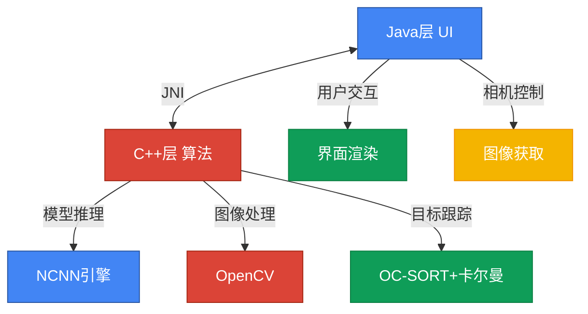
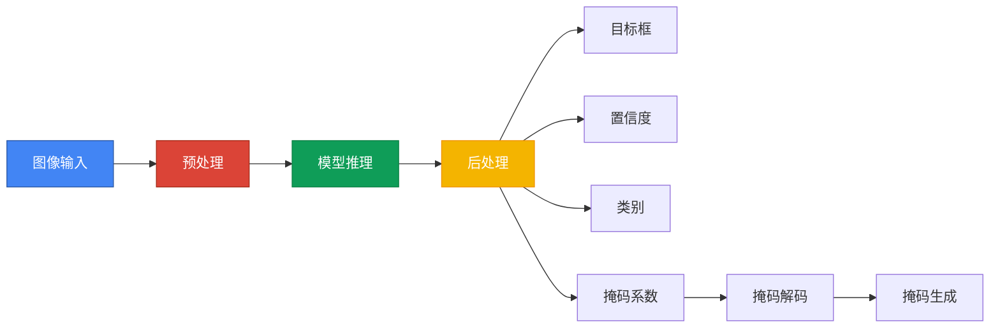
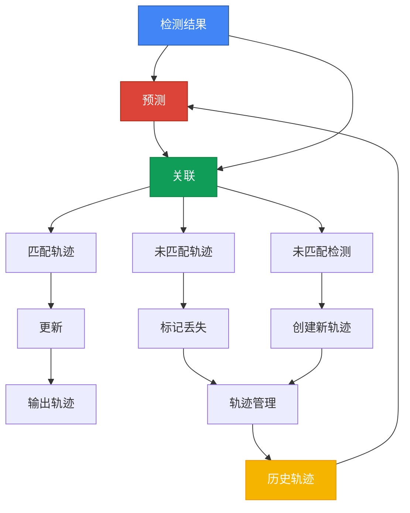
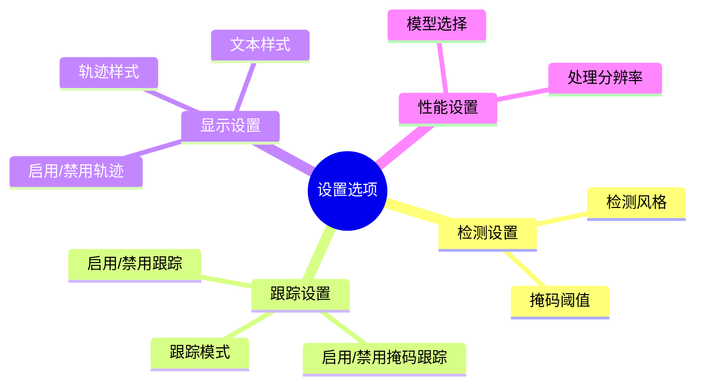

# AICV-Mobile 目标检测与跟踪系统 
<div align="center">


</div>

<p align="center">
<b>高效 · 精准 · 实时 · 智能</b>
</p>

## 📊 系统概览

AICV-Mobile 是一个基于**YOLOv8**和改进版**OC-SORT**算法的目标检测与跟踪系统，专为Android平台设计和优化。本系统实现了高效的目标检测、实例分割及目标跟踪功能，并支持掩码（分割）跟踪，能够实时跟踪目标的形状变化。

### ✨ 核心功能

| 功能 | 描述 |
|------|------|
| 🔍 **高效目标检测** | 基于YOLOv8模型，支持COCO数据集80类通用物体检测 |
| 🧩 **实例分割** | 支持物体的精确分割，生成掩码 |
| 🎯 **目标跟踪** | 实现了改进版OC-SORT算法，配合卡尔曼滤波器提高跟踪精度 |
| 🎭 **掩码跟踪** | 能够跟踪目标形状变化，支持掩码预测和时间域平滑 |
| 🎨 **多样化显示风格** | 支持多种检测框、掩码和轨迹的显示风格 |
| ⚡ **性能优化** | 针对移动设备进行了性能优化，禁用C++异常处理 |

## 🏗️ 系统架构

<div align="center">



</div>

### 📚 依赖架构

- **🚀 推理引擎**: NCNN (腾讯开源的神经网络推理框架)
- **🖼️ 图像处理**: OpenCV Mobile 4.6.0
- **📍 跟踪算法**: 改进版OC-SORT (Observation-Centric SORT) 思想 + Kalman Filter
- **📱 Android相机**: 基于Camera2 API

## 🧠 代码结构详解

### 📁 主要目录结构

```
app/src/main/
├── java/                // Java代码目录
│   ├── com/gyq/        // 主包目录
│   └── ylov/colorpicker// 颜色选择器组件
├── jni/                // C++代码目录
│   ├── yolo.cpp        // YOLO检测实现
│   ├── yolo.h          // YOLO类定义
│   ├── yolov8ncnn.cpp  // JNI接口实现
│   ├── EnhancedTracker.h // 增强版跟踪器
│   ├── OCsort.h        // 基础OC-SORT算法实现
│   ├── Object.h        // 检测对象定义
│   ├── TrackingParams.h // 跟踪参数定义
│   ├── ndkcamera.cpp   // 相机接口实现 (C++)
│   └── ndkcamera.h     // 相机接口定义 (C++)
└── assets/             // 模型文件目录
    └── yolov8*.bin/param // YOLO模型文件
```

### 🔧 核心组件说明

<details>
<summary><b>🔍 Yolo类 (yolo.h)</b></summary>

负责管理目标检测模型并执行推理。

```cpp
class Yolo
{
public:
    // 加载模型
    int load(AAssetManager* mgr, const char* modeltype, int target_size);
    
    // 目标检测
    int detect(const cv::Mat& rgb, std::vector<Object>& objects, float prob_threshold = 0.25f, float nms_threshold = 0.45f);
    
    // 结果可视化
    void draw(cv::Mat& rgb, const std::vector<Object>& objects);
    
    // 设置检测样式
    void setDetectionStyle(DetectionStyle style);
    
    // 模型类型
    enum ModelType { YOLOV8_N, YOLOV8_S, YOLOV8_M };
};
```

- 功能: 模型加载、检测、分割、参数配置、多数据集支持、结果绘制、掩码处理。
- 关键方法: `load()`, `detect()`, `draw()`, `setDetectionStyle()`。
</details>

<details>
<summary><b>🎯 跟踪系统</b></summary>

```cpp
// OC-SORT基础类
class OCSort {
public:
    OCSort(float iou_threshold = 0.3f, int max_age = 30);
    void update(const std::vector<Object>& detections);
    std::vector<Track> getTracks() const;
};

// 增强版跟踪器
class EnhancedTracker {
public:
    EnhancedTracker(const TrackingParams& params = TrackingParams());
    void update(std::vector<Object>& objects, float dt = 0.033f);
    void setParams(const TrackingParams& params);
};
```

1.  **OCSort类** (`OCsort.h`)
    - 实现基础版OC-SORT算法
    - 使用IoU和质心距离进行关联
    - 维护ID和生命周期
    
2.  **EnhancedTracking类** (`EnhancedTracker.h`)
    - 增强版跟踪器，整合卡尔曼滤波和OC-SORT思想
    - 支持掩码跟踪
    - 支持多种跟踪模式和参数配置
    
3.  **TrackingParams结构体** (`TrackingParams.h`)
    - 定义丰富的跟踪参数，支持场景优化配置
</details>

<details>
<summary><b>🎭 Object结构体 (Object.h)</b></summary>

表示检测和跟踪的目标对象。

```cpp
struct Object {
    cv::Rect rect;        // 目标边界框
    int label;            // 类别标签
    float prob;           // 置信度
    cv::Mat mask;         // 分割掩码
    std::vector<float> mask_feat; // 掩码特征 (或系数)
    int track_id;         // 跟踪ID
};
```
</details>

## 🧪 算法详解

### 🔍 目标检测 (YOLOv8)

<div align="center">



</div>

#### 📋 检测流程

1.  **预处理**: 调整大小、归一化、颜色转换
2.  **模型推理**: 使用NCNN执行前向推理 (支持GPU)
3.  **后处理**: 解析输出、NMS、生成检测结果 (框、置信度、类别)
4.  **掩码处理 (分割模型)**: 解码掩码系数、生成掩码、对齐边界框、阈值化

### 🎯 目标跟踪 (改进版OC-SORT + Kalman)

<div align="center">



</div>

#### 📋 跟踪流程

1.  **预测**: 使用卡尔曼滤波预测下一帧位置/状态
2.  **关联**: 计算预测与检测的代价矩阵 (IoU, 距离, 运动相似性)，贪婪匹配
3.  **更新**: 使用匹配的检测更新卡尔曼滤波器；未匹配跟踪标记为丢失；未匹配检测创建新轨迹
4.  **生命周期管理**: 根据命中/丢失次数管理轨迹，删除超时轨迹，确认新轨迹

#### 📋 掩码跟踪机制

1.  **掩码存储**: 维护最近N帧掩码历史 (及系数)
2.  **掩码预测**: 目标丢失时，基于运动预测变换 (warpAffine) 掩码
3.  **掩码平滑**: 时间域加权平均减少抖动，然后二值化

### 🛠️ 特殊场景优化

提供多种模式以适应不同场景。

<div class="styled-table">

| 场景类型 | 模式 | 描述 |
|---------|------|------|
| **空间分布** | 稀疏 | 目标少且分散 |
|  | 密集 | 目标密集，保守预测 |
|  | 超密集 | 极度拥挤，主要依赖观测 |
| **运动模式** | 静态 | 目标几乎不动 |
|  | 匀速 | 标准卡尔曼模型 |
|  | 匀加速 | 考虑加速度 |
|  | 可变 | 自适应调整模型 |
|  | 通用 | 平衡模式 |
| **相机模式** | 手持 | 针对相机移动优化 |

</div>

## ⚡ 性能优化

### 🚀 推理优化

- NCNN框架、ARM NEON、Vulkan GPU、模型量化(INT8)

### 💾 内存优化

- 内存池、禁用C++异常、共享网络层内存、低精度掩码表示

### 🧮 算法优化

- 简化跟踪计算、自适应NMS、动态分辨率、批处理

## 🎨 显示风格系统

<div align="center">
<table>
<tr>
<td align="center"><b>科技风格</b></td>
<td align="center"><b>未来风格</b></td>
<td align="center"><b>霓虹风格</b></td>
</tr>
<tr>
<td></td>
<td></td>
<td></td>
</tr>
</table>
</div>

### 📦 边界框风格

- 线条、颜色 (单色/类别/ID映射)、透明度

### 📝 文本风格

- 多种预设风格 (科技、未来、霓虹、军事、简约)

### 🎭 掩码风格

- 透明度、对比度、边缘类型、边缘颜色

### 🛣️ 轨迹可视化

- 显示轨迹点、配置长度、调整样式 (颜色/粗细)、启用/禁用

## 📈 系统扩展性

### 🔄 模型扩展

- 易于更换YOLO模型，自动/手动配置

### 📊 数据集扩展

- 内置COCO、OIV支持，可自定义类别文件

### 🧩 算法扩展

- 模块化跟踪设计，参数化配置，易于添加新策略

## ⚠️ 误差处理机制

因禁用C++异常，采用多层策略：

### 🛡️ 预防性检查

- 输入有效性、矩阵/变换尺寸、掩码有效性

### 🔄 容错机制

- 检测失败时依赖跟踪、掩码变换失败时回退、随机扰动防崩溃

### 📝 错误日志

- Android日志系统、分级日志、关键操作记录

## 💻 系统要求与编译说明

<table>
<tr>
<td>

### 📱 系统要求

- Android 6.0+ (API 23+)
- ARMv8 (arm64-v8a)
- 摄像头
- RAM >= 2GB

</td>
<td>

### 🔧 编译环境

- Android Studio 4.0+
- NDK r21+
- CMake 3.18+
- OpenCV Mobile 4.6.0
- NCNN 20230223+

</td>
</tr>
</table>

### 📋 编译步骤

```bash
# 1. 克隆代码库
git clone https://github.com/username/AICV-Mobile.git

# 2. 在Android Studio中打开项目

# 3. 同步Gradle
./gradlew sync

# 4. 编译安装
./gradlew installDebug
```

## 📖 使用指南

### 🔍 基本操作

1.  启动应用，授权相机
2.  对准目标
3.  自动检测与跟踪 (显示框、类别、置信度、ID、轨迹)

### ⚙️ 设置选项

<div align="center">



</div>

### 🔧 性能调优

- 选小模型 (YOLOv8n)
- 降分辨率
- 调整跟踪参数 (最大年龄、最小命中)

## 🔮 未来扩展计划

- 集成新模型 (YOLOv9+)
- ReID (重识别)
- 多相机联动
- 更多自定义风格
- 优化掩码预测
- 目标行为分析
- 支持更多硬件加速平台

## ❓ 故障排除

<details>
<summary><b>常见问题</b></summary>

| 问题 | 解决方案 |
|------|----------|
| 崩溃 | 检查内存使用、模型加载错误 |
| 检测不准 | 调整模型/阈值 |
| ID切换 | 调整IoU阈值/跟踪模式 |
| 掩码粗糙 | 调整平滑参数/阈值 |

</details>

<details>
<summary><b>性能问题</b></summary>

| 问题 | 解决方案 |
|------|----------|
| 低帧率 | 使用较小模型、关闭掩码功能 |
| 高内存 | 减少掩码历史长度 |
| 高GPU使用率 | 切换至CPU模式、降低处理分辨率 |
| 耗电快 | 降低帧率、使用高效模型 |

</details>

## 📚 参考资源

[](https://github.com/ultralytics/ultralytics)
[](https://arxiv.org/abs/2203.14360)
[](https://github.com/Tencent/ncnn)
[](https://opencv.org/)

---

<div align="center">
<p><i>AICV-Mobile © 2023 - Present</i></p>
</div>

<style>
/* 科技感样式 */
body {
    background-color: #0a192f;
    color: #8892b0;
    font-family: 'JetBrains Mono', monospace;
}

h1, h2, h3, h4, h5, h6 {
    color: #64ffda;
}

code {
    background-color: #112240;
    color: #a8b2d1;
    border-radius: 4px;
}

.styled-table {
    border-collapse: collapse;
    width: 100%;
}

.styled-table th, .styled-table td {
    border: 1px solid #64ffda;
    padding: 8px;
    text-align: left;
}

.styled-table th {
    background-color: #112240;
    color: #64ffda;
}

details summary {
    cursor: pointer;
    color: #64ffda;
    font-weight: bold;
}
</style> 